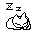
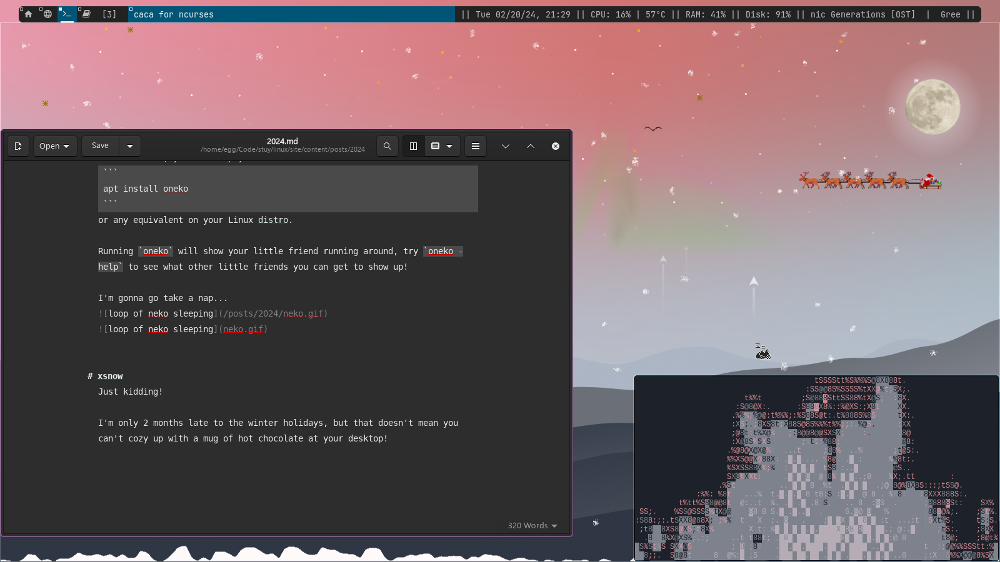

Every year, people discuss how this year will totally definitely be the year of 
the Linux desktop, where Linux desktops become mainstream and topple Microsoft 
from the dominant market position.

The odds of this actually happening are as likely as Half Life 3 releasing; 
probably not but there's always a little hope! Personally, my bets are on late 
2025/2026 as the actual year where things will change, what with Windows 10 
becoming end-of-life that year. Of course, this assumes that people will 
actually be concerned about keeping their OS up to date (looking at you, 
Windows XP users!) and that they don't simply buy something new to bow to the 
Windows 11 TPM requirement that "obsoletes" plenty of perfectly fine hardware.

On an unrelated note, I suspect more ~~e-waste~~ cheap computer listings on 
eBay to pop up in the coming years, it'll be a great time to look for a laptop 
to tide me through college!

Anywho, here's a few little desktop toys for Linux (X11) systems we played with 
at our first meeting!

# oneko
`oneko`, specifically the [sakura](http://www.daidouji.com/oneko/) edition, which comes with additional character sprites, has existed for eons in one form or another.

All of them are in essence little desktop toys where a sprite (usually a tiny kitty) runs around chasing your "mouse."

To install it, you can simply run
```
apt install oneko
```
or any equivalent on your Linux distro.

Running `oneko` will show your little friend running around, try `oneko -help` to see what other little friends you can get to show up!

I'm gonna go take a nap...




# xsnow
Just kidding!

I'm only 2 months late to the winter holidays, but that doesn't mean you can't cozy up with a mug of hot chocolate at your desktop!

Just `apt install xsnow`, and `xsnow` will bring up a menu for you to customize your festive experience.



A (belated) happy holidays to all, wishing you all a wonderful year!

