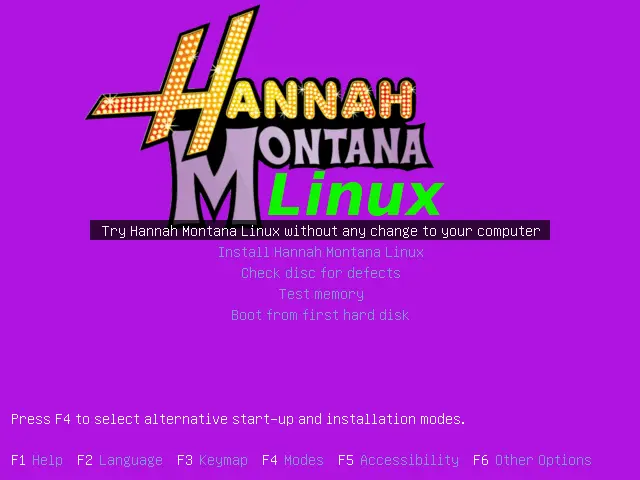
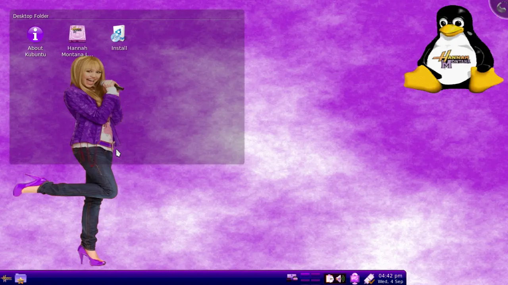
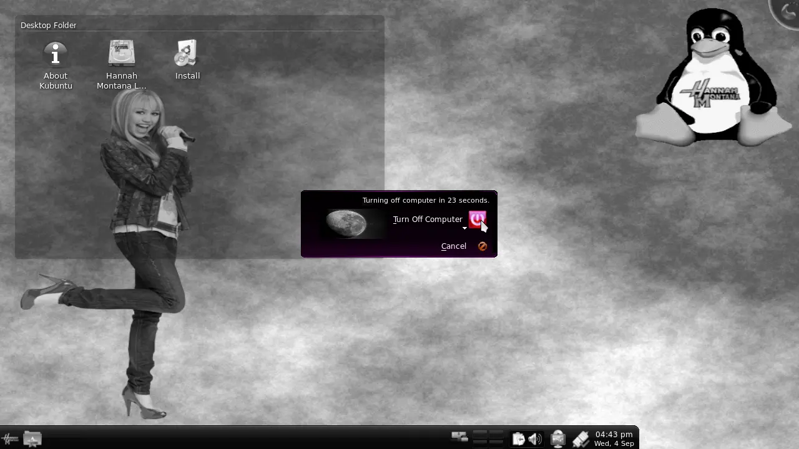

Our regular meeting day happened to fall on Justin Bieber's birthday earlier 
this year; what better way to "celebrate" than to check out some Linux-based 
artifacts of early 2010s culture! ~~and the music. Rohan enjoyed the music 
quite a bit...~~

To demo these distros at our meeting, we used a slightly overcomplicated way 
(which took me way too many whiteboard diagrams to describe) to stream a 
virtual machine to the StuyCS display.

## A Virtual Machine?? In the Containers Club?? I must inquire about this 
further with my supervisor post-haste!!
Since the main appeal of these distros are their desktop applications ~~and 
last I checked, they were not on the Incus/LXD image servers~~, we could not 
use our usual command-line container format for this meeting.

Instead, using `virt-manager` with QEMU/Kernel Virtual Machines, we can run a 
virtual desktop on my home PC, and have the display and I/O accessible over 
[Virtual Network 
Computing](https://en.wikipedia.org/wiki/Virtual_Network_Computing) (VNC, not 
to be confused with the DNC). This would already work wonderfully, but there is 
one little problem: the StuyCS computers did not have a VNC client installed!

The fact that there was no VNC client installed meant we would have to use 
[noVNC](https://novnc.com/info.html), a web-based VNC client. I did not want to 
pollute my PC with the noVNC install, so I ran a Debian Incus container. This 
container then had an SSH tunnel linking the noVNC web server to the StuyCS 
computers. This meant that in the end, I would be running Firefox, connecting 
over an SSH tunnel to noVNC, which in turn VNCed to my PC screen displaying the 
virtual machine we were using. Try saying that ten times fast!

### Live Virtual Machine Reaction
With the virtual machines now being projected onto the StuyCS computers, we 
could boot up ISO images of the distros I had prepared beforehand, and play 
around with them!

#### Justin Bieber Linux (Biebian)
The star of the show! [Justin Bieber Linux](https://biebian.sourceforge.net/) 
is an old Puppy Linux based distro that has images of the young star plastered 
all over the place.

I am somewhat impressed that they even got a picture of him in the boot screen!

I am happy to report that `www.justinbiebermusic.com` is still online to this 
day, though a quick glance couldn't reveal this lovely wallpaper.

Because of this distro's age, most SSL certificates are out of date and 
accessing the web — much less daily-driving the distro — is inconvenient to 
say the least.

#### Hannah Montana Linux
[Hannah Montana Linux](https://hannahmontana.sourceforge.net/)[^1] is one of 
the oldest and best known celebrity-themed "distros," with a pink theme 
befitting the Miley Cyrus show of all time. The distro is based on an old 
version of Kubuntu, the KDE flavor of Ubuntu.

[^1]: [1] Today I learned they have a 
[song](https://hannahmontana.sourceforge.net/song.html)!

When booting up, you are greeted by the Hannah Montana Linux logo and a 
~~garishly~~ pink background, along with options to select your system language 
and boot settings. The UI is reminiscent of classic Windows operating systems.

On the desktop, you get a pink cloud background featuring the star of the show, 
Tux with a Hannah Montana Logo on his belly, along with some lady as a 
background character to fill space. The desktop is also very very reminiscent 
of the XP era of UI design.

Speaking of which, when the shut down button is pressed, the screen grays out 
and presents a confirmation prompt, just like Windows NT Home edition.

#### Stuy Linux
One thing that we have been working on for a bit is our own "Stuy Linux" 
distribution, which bundles the language toolchains an average StuyCS student 
might need, such as Racket, NetLogo, and Python for the Intro courses, along 
with Java and Processing for the APCS/NextCS folks. In addition, tooling like 
Git and SFTP mounts — which can provide transparent access to StuyCS server 
home directories — provides for a comprehensive and convenient programming 
environment. Stick around and maybe you'll be able to contribute to its release!
