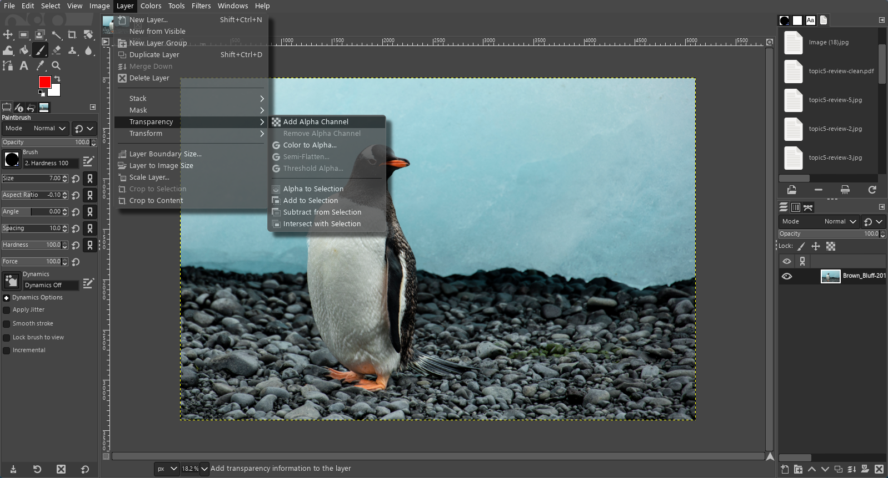
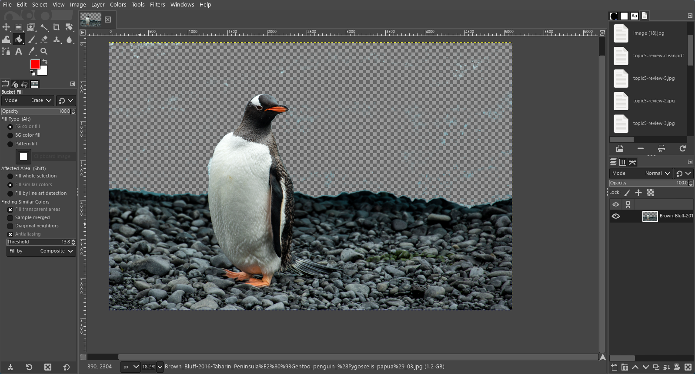
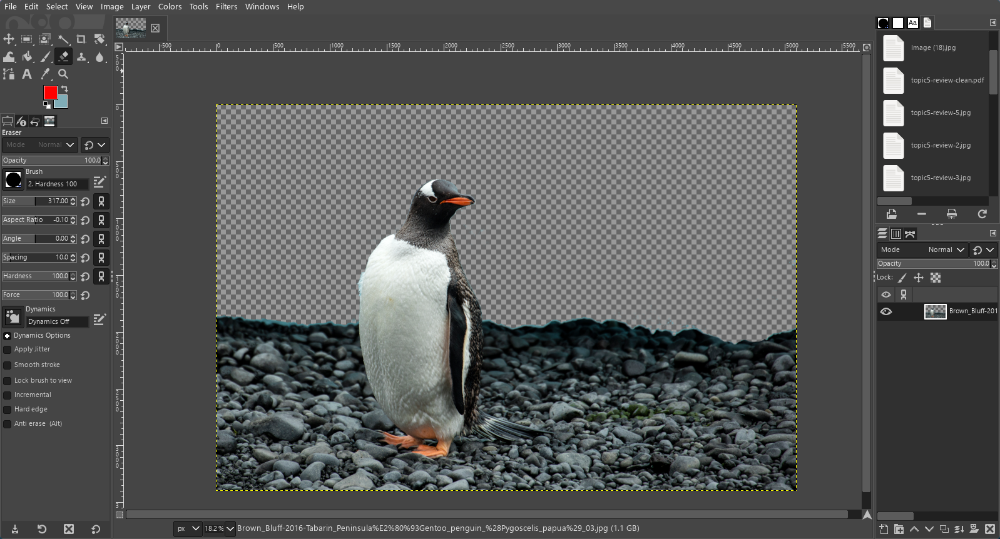
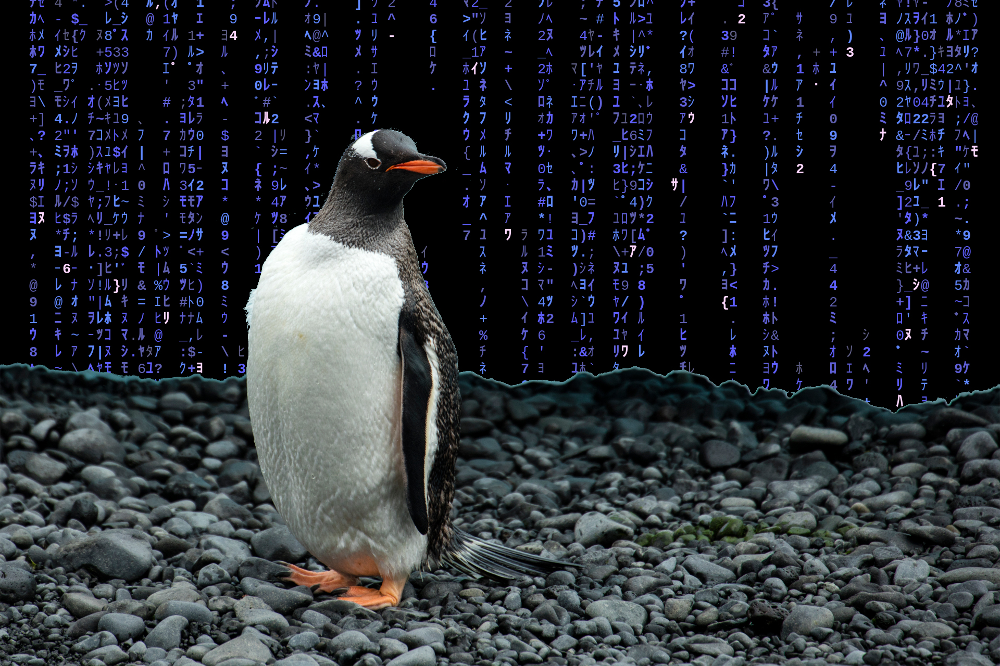

This is really stretching it, but I figured that since we watched _The Matrix Reloaded_, we would try out some little terminal toys that emulates the "digital rain" effect.

In addition, since image processing _technically_ involves matrices, we'll look into photo editing with GIMP!

# cmatrix
This is a popular little program that is [packaged in many distros](https://repology.org/project/cmatrix/versions). To install it on Alpine Linux, simply run
```
apk add cmatrix
```

Unsurprisingly, to run cmatrix, simply type the command
```
cmatrix
```

Through the power of ncurses, you'll now see a screen of magic 31337 h@x0r text.

To exit, simply press `q` to quit, which is a common shortcut to quit many a CLI program.

# neo
This is a newer take on the Matrix "rain" effect, with a rich set of options to let you express yourself with your own unique "hacker" screen.

Neo is not commonly packaged on most distros, so we will have to manually build it ourselves.

We will install [GNU Autoconf](https://www.gnu.org/software/autoconf/) and set up the build recipes from the latest revision of the source code, but you can also skip these first steps by downloading the code off of their [releases page](https://github.com/st3w/neo/releases).

First, let's checkout the latest revision of the source code (`apk add git` if you don't have it installed!):
```
git clone https://github.com/st3w/neo.git
cd neo
```

We'll need `autoconf` and `automake` to generate the build scripts, so let's
```
apk add autoconf automake
```
and then
```
./autogen.sh
```

Now, we have the `./configure` script, which will locate all the dependencies we need. Make sure to install the C++ toolchain, along with the developer headers for ncurses by running
```
apk add build-base ncurses-dev
```

We can now run `./configure` to set up the `Makefile`, and call `make` (with 3 Jobs at once, to utilize the multiple threads on your computer... you are doing this on a computer with at least 4 threads, right?)
```
./configure
make -j3
```
This will pop out the final program onto `src/neo`, but if you want to have `neo` on your PATH for instant hackermaning at a drop of a dime, run `make install` as root, allow you to run `neo` in the terminal as you would any other program.

Check out `man neo` (you'll have to `apk add mandoc` on Alpine) to see all the lovely options `neo` provides. Have fun making the craziest screens you've ever seen!

And don't forget...


# GIMP
The GNU Image Manipulation Program is one of the main FOSS options for image editing and other touchups, though there are alternatives like [Photopea](https://www.photopea.com/) and [Krita](https://krita.org/en/) (designed for drawing).

We will take a real photograph, perhaps of a cute Gentoo penguin (credit to [Andrew Shiva](https://commons.wikimedia.org/wiki/File:Brown_Bluff-2016-Tabarin_Peninsula%E2%80%93Gentoo_penguin_%28Pygoscelis_papua%29_03.jpg), and cut out the penguin to place on a hackery background (aka a screenshot of neo).


First, [install GIMP](https://gimp.org) if you have not already, it can be found in the repos of most desktop Linux distros.

Open up our image in the editor, and add an alpha channel.


Using the paint bucket set to `Erase` mode, and playing with the threshold level, we can get the vast majority of the background erased. There may still be some dust left over, so feel free to brush it over with the eraser or paintbrush tools.



Now that we have a foreground, let's get some imagery for the background.

Take a screenshot of your terminal running your favorite instance of `neo`, and go to `File > Open as Layers` to import it to this workspace. Alternatively, copy-paste it in!

If you copy-pasted the new layer, press the green add layer button at the bottom right to create a new layer.

Drag the layer to be below our source image. Now you'll see it peeking out from under our transparent mask.

You can edit things however you like, adding text, scaling images, etc., and in the end, you'll have made something of your own!

To export your masterpiece for wallpapering purposes, head to `File > Export as...`, and save it however you like, in the format you prefer (JPG is usually good enough).

Congratulations! You have just created your own little design! Feel free to screenshot, share, turn into an NFT, whatever, assuming you have the correct licenses for the source images (or better yet, own them all yourself).

Here's the final wallpaper I made, as a derivative work of the `Creative Commons Attribution-Share Alike 4.0 International` licensed Wikimedia image!

